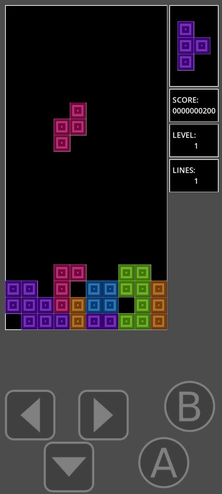

# Learning GDScript in Godot by making a clone of Tetris

I chose to represent the board in a 2d array and then render the game by the `_draw` function.

## TODO:
- [x] Fix shape rotating over other pieces :heavy_check_mark:
- [ ] ~~Shapes to 'bump' left or right if at the edge of play area and rotation will push them out of bounds~~ - not done, tetris doesn't do this
- [x] Add some rows above the viewable board for  shapes to spawn into, donn't display :heavy_check_mark:
- [x] Add the `coming next` shape box, score and button areas :heavy_check_mark:
- [x] Score board :heavy_check_mark:
- [x] Start, play and end states :heavy_check_mark:
- [x] Touch buttons :heavy_check_mark:
- [ ] Add a `cheat code` for special state
- [x] Add colours to the board :heavy_check_mark:
- [x] Holding L/R buttons continued to move the pieces :heavy_check_mark:
- [ ] Add options menu
- [ ] Add sound fx and music
- [ ] add pause function
- [ ] Use `signals` to set up node variables and use `get_node` in other nodes when `signal` is emitted
- [ ] Create proper icons
- [ ] Add up arrow (full D-pad) so menus can be used

## Notes:

